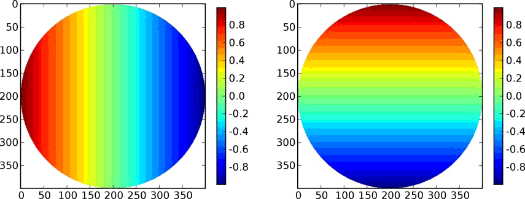
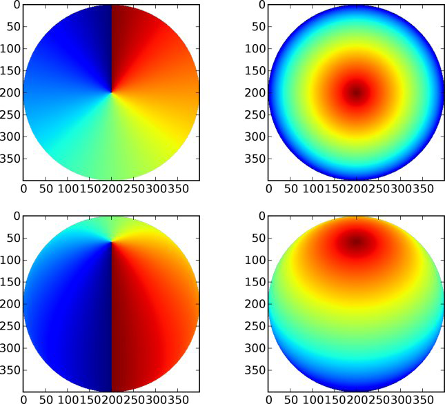
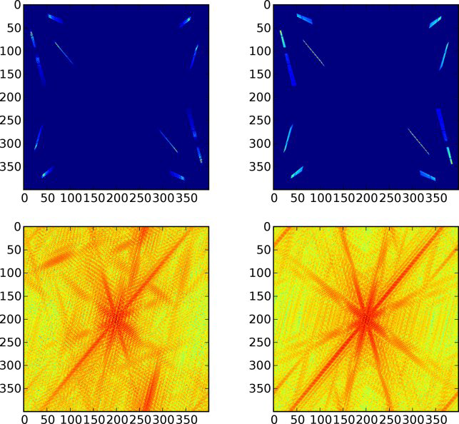

Miriad UV Files
===============
Reading an Existing File
------------------------
A high-level interface to Miriad UV files is available through the :class:`aipy.miriad.UV` 
class.  We'll dive right in to reading a file, but first, so that we're working on the 
same UV file, run the following from bash (1 MB download)::

	wget http://setiathome.berkeley.edu/~aparsons/aipy/test.uv.tar.bz2
	compress_uv.py -x test.uv.tar.bz2

You should now have a `test.uv` file in your current directory.  Try the following from 
Python:

>>> import aipy
>>> uv = aipy.miriad.UV('test.uv')
>>> print uv.items()
['vartable', 'obstype', 'history']
>>> print uv['history']
C2M (Python): Version=0.1.1.Fixed bandpass inversion & ordering, and pol
label.APPLY_BP: version=0.0.1, corr type = combXRFI: version 0.0.2XTALK2:
version 0.0.1 Miniaturized...
>>> print uv.vars()
['latitud', 'npol', 'nspect', 'obsdec', 'vsource', 'ischan', 'operator',
'nants', 'baseline', 'sfreq', 'inttime', 'source', 'epoch', 'version',
'ra', 'restfreq', 'nschan', 'sdf', 'corr', 'freq', 'longitu', 'nchan',
'tscale', 'antpos', 'telescop', 'pol', 'coord', 'veldop', 'lst', 'time',
'dec', 'obsra']
>>> print uv['nchan']
64
>>> print uv['antpos']
[ -8.48 205.47 187.1 -262.7 455.28 319.53 -352.95 -219.07 9.82
-251.71 -232.59 318.7 ]

First, we made an instance of a UV file (which defaulted to read an "old" file).  We 
could then ask for a list of (header) items.  Each of these header items can then be 
accessed just as if uv were a dictionary holding them.  The details of data types are 
taken care of automagically; strings return as Python strings, shorts and ints return as 
Python integers, floats and doubles return as Python floats.  Similarly, we can ask for 
a list of variables (vars), and these are accessible as if uv were a dictionary.  As you 
can see, when we are reading, there's no real need to differentiate between a header 
item and a variable, and so both are accessible via the same interface. When we access 
"nchan", which has a single value, we get that value.  When we access "antpos", which has 
multiple values, we get an array of the values.  

.. warning::
	Do not access the "corr" variable. It is evil, and I don't know why Miriad makes 
	it available.

Let's continue:

>>> preamble, data = uv.read()
>>> print preamble
(array([ 0., 0., 0.]), 2454302.8700115741, (0, 0))
>>> print data
[(3.55898427963+0j) (5.16037225723+0j) (7.65382957458+0j)
(11.5349502563+0j) (17.6214637756+0j) (26.8085384369+0j)
(40.0749702454+0j) (56.860118866+0j) (74.8811569214+0j) (89.6064910889+0j)
(98.601524353+0j) (101.491455078+0j) (100.617973328+0j) (98.0315933228+0j)
(95.0735092163+0j) (92.583152771+0j) (90.0556259155+0j) (88.2838745117+0j)
(86.3324737549+0j) (84.3934631348+0j) (82.3522338867+0j) --
(77.4334640503+0j) (74.7851333618+0j) (71.8084716797+0j)
(68.7729568481+0j) (65.6971817017+0j) (62.5315704346+0j) (59.719078064+0j)
(56.9530410767+0j) (54.4193191528+0j) (52.1953392029+0j)
(50.2718162537+0j) (48.5867958069+0j) (47.1000137329+0j)
(45.9260749817+0j) (44.9503746033+0j) (44.1512298584+0j) (43.609172821+0j)
(43.2684516907+0j) (43.1135787964+0j) (42.8874664307+0j)
(42.9587059021+0j) (43.0020713806+0j) (43.1228713989+0j)
(43.1600418091+0j) (43.1321640015+0j) (43.1135787964+0j)
(43.0020713806+0j) (42.726398468+0j) (42.5312576294+0j) (42.1409759521+0j)
(41.6794548035+0j) (41.0073051453+0j) (40.369228363+0j) (39.5948638916+0j)
(38.8019142151+0j) (38.0523262024+0j) (37.1168937683+0j)
(36.1814575195+0j) (35.2924880981+0j) (34.3105926514+0j)
(33.4278144836+0j) (32.3839683533+0j)]
>>> print uv['pol'], aipy.miriad.pol2str[uv['pol']]
-6 yy
>>> preamble, data = uv.read()
>>> print preamble
(array([-538.6, 298.79613781, -674.73816035]), 2454302.8700115741, (1, 3))
>>> preamble, data, flags = uv.read(raw=True)

We read a preamble/data pair.  The preamble contained (uvw, time, (i,j)), and the 
data was a masked, complex Numpy array.  One of the entries was masked (see the "-"), 
and did not print.  If you count, there are 64 entries, just like "nchan" suggested. 
This was an autocorrelation (0,0), so the data has no complex component, and the 
uvw corrdinates are 0.  Next, we showed how to access and convert the polarization
codes.  Following another read(), we find that we have a new preamble for a different 
baseline, but for the same time.  Finally, we demonstrate the option "raw" for uv.read, 
which returns data and flags as separate arrays, and executes substantially faster.  

Now for some more advanced stuff:

>>> uv.rewind()
>>> uv.select('antennae', 0, 1, include=True)
>>> for preamble, data in uv.all():
... uvw, t, (i,j) = preamble
... print i, j, t
...
0 1 2454302.87001
0 1 2454302.87009
0 1 2454302.87017
0 1 2454302.87025
[snip]
0 1 2454302.91135
0 1 2454302.91144
0 1 2454302.91152
0 1 2454302.9116

First, we rewound the uv file so that we could start from the beginning again.  Next, we 
demonstrated one usage of select()-a function that allows you to choose which data you 
receive via read().  In this case, we've selected to only include data that involve 
antennae 0 and 1 together.  We set up a loop over all the data in uv, split up the preamble 
into its components, and print the antennae in the baseline and the time of integration. 
Note that (*i,j*) == (0; 1), thanks to select(), and we step through all the integrations 
in the file.  Inside the loop, you can access variables as they change. Just like uv.read(), 
uv.all() has a "raw" operative that returns data and flags separately.

Initializing and Piping From Another UV File
--------------------------------------------
Quite often, you will find yourself wanting to read in a UV file, operate on the data, and 
then write the data out to a new file.  Building a UV file from scratch is a pain, but 
copying one shouldn't be.  Starting with a fresh console, here's how to do it:

>>> import aipy
>>> uvi = aipy.miriad.UV('test.uv')
>>> uvo = aipy.miriad.UV('new1.uv', status='new')
>>> uvo.init_from_uv(uvi)
>>> def conjugate_01(uv, preamble, data):
... uvw, t, (i,j) = preamble
... if i == 0 and j == 1: return preamble, data.conjugate()
... else: return preamble, data
...
>>> uvo.pipe(uvi, mfunc=conjugate_01, append2hist="Conjugated (0,1)\n")
>>> del(uvo)

We opened up test.uv, and started a new file new.uv. Then we initialized the new file with 
the old one (all the header items and initial variables got copied across) with init from 
uv().  Next, we defined a "mapping function" or "mfunc".  This is a function that accepts a 
(uv, preamble, data), and returns a (preamble, data).  The idea is that this function 
operates on the preamble and data from the old file (along with a reference to the old file 
so you can access any variables and items you need), and returns the preamble and data for
the new file.  In our case, we have defined a function that conjugates the (0,1) baseline. 
We piped the data from uvi through mfunc to uvo, and append a string onto the history of the 
file.  Just like read() and all(), pipe() accepts the keyword "raw" to pass data and flags 
as separate arrays into mfunc.  In this case, your mfunc should be defined to accept arguments 
(uv, preamble, data, flags).

At the end of the above code snippet, we deleted uvo.  This is normally not necessary, but 
some interactive consoles to not properly destruct their variables, and thus improperly close a 
new UV file.  When you are writing scripts, there is no need to delete.

Now suppose you want a new file that relabels the "pol" variable for all integrations, and 
removes the variables "ra" and "lst" (which happen to have incorrect values in this file). 
Continuing where we left off:

>>> uvi = aipy.miriad.UV('new1.uv')
>>> uvo = aipy.miriad.UV('new2.uv', status='new')
>>> uvo.init_from_uv(uvi, override={'pol':-7}, exclude=['ra','lst'])
>>> uvo.pipe(uvi)
>>> del(uvo)

This time, we passed override and exclude parameters to init from uv(). "Override" is a 
dictionary of variables (or items) and new values, and variables (or items) in "exclude" are 
omitted from the output file.  If you wish to rewrite a variable on an integration-by-
integration basis, place that variable with some value in override, and then use uvo to set 
the variable inside a mapping function:

>>> uvi = aipy.miriad.UV('new2.uv')
>>> uvo = aipy.miriad.UV('new3.uv', status='new')
>>> def change_pol(uv, p, d):
... uvw, t, (i,j) = p
... if i == j: uvo['pol'] = -5
... else: uvo['pol'] = -6
... return p, d
...
>>> uvo.init_from_uv(uvi, override={'pol':-7})
>>> uvo.pipe(uvi, mfunc=change_pol)
>>> del(uvo)

By placing the variable in override, it is prevented from being automatically updated every 
time its value changes in the input file.  We are then free to set that variable from the mapping 
function and have the changes stick.  Based on the data type of the variable you are writing, 
you are expected to provide an appropriately typed Python variable.  An error will get thrown 
when you don't.

Writing a UV File from Scratch
------------------------------
So far, we've been able to sweep details about data types under the rug.  This is because, for a 
written UV file, we can infer the data types of all the items (which are statically typed in the 
Miriad User Guide) and variables (which are specified in the vartable header item). However, when 
we are writing a file from scratch, we can't do this for variables anymore.  Because the data types 
of header items are spelled out ahead of time (in :data:`aipy.miriad.itemtable`, if you're 
wondering), we only need to do this for variables.

	Miriad Data Types:

	+---+-----------------------------------+
	| a | ascii (NULL terminated)           |
	+---+-----------------------------------+
	| r | real (32 bin IEEE)                |
	+---+-----------------------------------+
	| d | double (64 bit)                   |
	+---+-----------------------------------+
	| c | complex (2 * 32 bit IEEE)         |
	+---+-----------------------------------+
	| i | integer (32 bit two's complement) |
	+---+-----------------------------------+
	| j | short (16 bit two's complement)   |
	+---+-----------------------------------+

Python wrapper routines use strings to code data types, according to the Miriad convention (see 
above, or :data:`aipy.miriad.data` types).  The following illustrates how to write a file from 
scratch:

>>> import aipy, numpy
>>> uv = aipy.miriad.UV('newest.uv', 'new')
>>> uv['history'] = 'Made this file from scratch.\n'
>>> uv.add_var('nchan', 'i')
>>> uv.add_var('pol', 'i')
>>> uv['nchan'] = 4
>>> uv['pol'] = -5
>>> uvw = numpy.array([1,2,3], dtype=numpy.double)
>>> preamble = (uvw, 12345.6789, (0,1))
>>> data = numpy.ma.array([1j,2,3j,4], mask=[0,0,1,0], dtype=numpy.complex64)
>>> uv.write(preamble,data)
>>> uv['pol'] = -6
>>> uv.write(preamble,data)
>>> del(uv)
>>> uv = aipy.miriad.UV('newest.uv')
>>> for p, d in uv.all():
... print p, uv['pol']
... print d
...
(array([ 1., 2., 3.]), 12345.678900000001, (0, 1)) -5
[1j (2+0j) -- (4+0j)]
(array([ 1., 2., 3.]), 12345.678900000001, (0, 1)) -6
[1j (2+0j) -- (4+0j)]

After creating a new file and demonstrating that we can immediately write to a header item 
like "history", we added 2 new variables: "nchan" and "pol".  Strictly speaking, a UV file 
doesn't have to have "nchan", but the Python wrapper uses this value to effciently create an 
array exactly large enough to hold the data, so it's a good variable to include.  Both "nchan" 
and "pol" are integers.  Although you are free to make any variable any type you want, there 
are conventions to follow if you want to use routines that are part of the Miriad package. 
These conventions are in the back of the Users Guide mentioned in x3. After writing the first 
values of these variables, we construct a preamble and a datum (paying careful attention to the 
types needed for each).  Between spectra, we flipped "pol". After finishing the file, we close 
it and the open it for reading.  Looks like it works!

Working with Antenna Arrays
===========================
:class:`aipy.phs.AntennaArray` inherits from :class:`aipy.phs.ArrayLocation` so that 
youcan pass it to the compute() of a :class:`aipy.phs.RadioBody` or 
:class:`aipy.phs.SrcCatalog`.  Secondly, an AntennaArray is initialized with a list of
:class:`aipy.phs.Antenna` instances, and those contain :class:`aipy.phs.Beam` instances, \
so an AntennaArray has all the information needed to figure out phasing.  Let's learn by 
example, starting from scratch:

>>> import aipy, numpy
>>> freqs = numpy.array([.150,.160,.170])
>>> beam = aipy.phs.Beam(freqs)
>>> ants = []
>>> ants.append(aipy.phs.Antenna(0,0,0,beam,delay=0,offset=0))
>>> ants.append(aipy.phs.Antenna(0,100,0,beam,delay=1))
>>> ants.append(aipy.phs.Antenna(100,0,0,beam,offset=.5))
>>> aa = aipy.phs.AntennaArray(ants=ants,location=("18:20:39","-66:45:10"))
>>> print aa.get_baseline(0,2,'r'), aa.get_phs_offset(0,2)
[ 100. 0. 0.] [ 0.  0.  0.]
>>> aa.set_jultime(2454447.37472)
>>> srcs = []
>>> srcs.append(aipy.phs.RadioSpecial("Sun"))
>>> srcs.append(aipy.phs.RadioSpecial("Venus"))
>>> cat = aipy.phs.SrcCatalog(srcs)
>>> cat.compute(aa) # REMEMBER to call this before projecting!
>>> print aa.get_baseline(0,1,src=cat['Sun'])
[ 34.6664193  -36.79755778 -86.27965644]
>>> print aa.get_baseline(0,1,src=cat['Venus'])
aipy.phs.PointingError: Venus below horizon

We made a Beam with frequency information, created 3 Antennas using the same Beam, and 
then made an AntennaArray at Arecibo with those Antennas.   We showed how we can access 
baselines and offsets, obeying sign conventions depending whether you specify (0,1) or 
(1,0).  We made a SrcCatalog containing the Sun and Venus, and then we computed their 
locations relative to the AntennaArray.  It is important to always call compute() before 
proceeding to other processing. At best you will get an error.  At worst, you could end 
up with old positions.  Finally, we retrieve baseline (0,1) projected towards the Sun, 
and then try to do the same towards Venus.  However, Venus is below the horizon, and 
rather than let you use a projection that will give incorrect results, AIPY throws a 
PointingError.  If you want, you can catch this exception (:class:`aipy.phs.PointingError`) 
and recover.  

.. note:: 
	The coordinate returned here are still in nanoseconds and are not yet proper uvw 
	coordinates.

Let's continue:

>>> print aa.gen_phs(cat['Sun'], 0, 1)
[ 0.93421349-0.3567144j   0.33723017-0.94142223j -0.49523164-0.86876097j]
>>> data = aa.phs2src(numpy.array([.5,1,0j]),cat['Sun'],1,2)
>>> print data
[-0.07802227+0.49387501j  0.83315419+0.55304077j  0.00000000+0.j        ]
>>> uvw = aa.gen_uvw(1,2,cat['Sun'])
>>> print uvw
[[[  8.86987669   9.4612018   10.05252691]]
 [[  7.55959227   8.06356508   8.5675379 ]]
 [[ 17.72506283  18.90673368  20.08840454]]]
>>> print aa.unphs2src(data,cat['Sun'],1,2)
[ 0.5+0.j 1.0+0.j 0.0+0.j]

Using the AntennaArray and SrcCatalog we created earlier, we can now use gen_phs() to return 
the phases that, when multiplied by data for the specied baseline, will flatten the fringes 
of that source.  Note that 3 values are returned here for the 3 active frequencies (we set 
them in the Beam).  We could apply these phases to the data ourselves (or take the complex 
conjugate and call it simulated data), but phs2src() does that for us.  We can also get the 
corresponding uvw coordinates projected toward this source using gen_uvw().  Note again the 3 
entries in uvw for the 3 active frequencies. To undo what phs2src() just did, there is 
unphs2src().

Imaging
=======
An :class:`aipy.img.Img` instance is responsible for storing the UV matrix and the beam matrix 
that can be inverted, using a fast Fourier transform, to get the dirty image and the dirty beam, 
respectively.  You start by specifying the size of your two matrices in UV coordinates by 
providing a size (number of wavelengths across your matrix) and a resolution (number of pixels 
per wavelength).  The size of your UV matrix determines the resolution of your image (image 
resolution = 1/UV size) and the resolution of your UV matrix determines the field-of-view of your 
image on the sky (image size in *l,m* = 1/UV resolution).

Coordinate Systems
------------------

>>> import aipy
>>> from matplotlib import pylab
>>> im = aipy.img.Img(size=200, res=0.5)
>>> L,M = im.get_LM(center=(200,200))
>>> pylab.subplot(121); pylab.imshow(L); pylab.colorbar(shrink=.7)
>>> pylab.subplot(122); pylab.imshow(M); pylab.colorbar(shrink=.7)
>>> pylab.show()

   Plotted are the *lm,* coordinates for an Img with size=200, res=0.5. Note that *l* measures +E -W,
   and *m* measures +N -S.  AIPY follows the convention that for images, coordinates increase right to 
   left and bottom to top (assuming the origin is placed in the top-left corner).  This presents a 
   geocentric view of the sky.

In the above snippet, we've defined a matrix 200 wavelengths across, with a resolution of 0.5 
wavelengths.  In image domain, this generates an image with a resolution of :math:`\sim0.28^\circ` 
near image center (and decreasing resolution away from center), and a range of :math:`-90^\circ` to 
:math:`+90^\circ` since *l,m* range from -1 to 1.

.. note::
	This generates sky coordinates which are outside the range of physical possibility. These 
	coordinates are masked.

Internally to Img, UV and image centers are at (0,0).  To recenter for plotting, where it is preferable 
that image center is in the middle of the screen, most functions that return a matrix accept a "center" 
argument with a pixel offset.

AIPY follows the convention that *l* increases right to left, and *m* increases bottom to top, 
assuming the origin is placed in the top-left corner.  This gives us a geocentric view of the 
sky.  Before we get into actual imaging, lets explore coordinates a little more.  Continuing from 
above:

>>> xyz = im.get_top(center=(200,200))
>>> az,alt = aipy.coord.top2azalt(xyz)
>>> pylab.subplot(221); pylab.imshow(az)
>>> pylab.subplot(222); pylab.imshow(alt)
>>> xyz = im.get_eq(ra=0, dec=3.14/4, center=(200,200))
>>> ra,dec = aipy.coord.eq2radec(xyz)
>>> pylab.subplot(223); pylab.imshow(ra)
>>> pylab.subplot(224); pylab.imshow(dec)
>>> pylab.show()

   On the top row are plotted topocentric coordinates for an Img in azimuth (angle clockwise from N)
   and altitude (angle from horizon).  The second row shows right-ascension and declination coordinates 
   in the current epoch for an observer at :math:`+45^\circ` latitude with 0:00 right ascension 
   overhead.  Coordinate transformations are provided by the :mod:`aipy.coord` module.

The above example illustrates how topocentric coordinates (useful for calculating beam patterns) and 
equatorial coordinates (useful for calculated source positions) at the current epoch are both 
available through an Img. 

.. note::
	The :mod:`aipy.coord` module also provides all functionality for converting between coordinate
	systems and precessing to various epochs; the several coordinate systems available through Img 
	are just for convenience.

Gridding and Imaging
--------------------
It is finally time to generate a dirty image. To do this, we will gather visibility samples, 
calculate the uvw coordinates where they were measured, and then grid the samples and weights onto 
a matrix using Img.put().  Finally, we will use an inverse Fourier transform to generate a dirty 
image and matching dirty beam.  For data, we will use the same test.uv file as in previous sections, 
with associated parameters recorded in :mod:`aipy.cal` under "pwa303".  These files are attainable 
via::

	wget http://setiathome.berkeley.edu/~aparsons/aipy/test.uv.tar.bz2
	wget http://fornax.phys.unm.edu/aipy-1.0.x/pwa303.py
	compress_uv.py -x test.uv.tar.bz2

Starting with a fresh Python interpreter, we will open our Miriad UV file and prepare an AntennaArray
with antenna positions derived from the "pwa303" location key in :mod:`aipy.cal`, and frequency channels 
matching the data in the UV file (sdf, sfreq, nchan).  We will also choose a source (in this case, 
"vir" indicates Virgo A from :mod:`aipy.src`) to phase our data to, putting it at the center of our 
image:

>>> import aipy, numpy as np
>>> from matplotlib import pylab
>>> uv = aipy.miriad.UV('test.uv')
>>> aa = aipy.cal.get_aa('pwa303', uv['sdf'], uv['sfreq'], uv['nchan'])
>>> srcs = aipy._src.misc.get_srcs(srcs=['vir'])
>>> src = srcs[0]

Next, we will gather visibility data from the UV file and calculate the corresponding uvw coordinates
using our AntennaArray and celestial source.  We will not include auto-correlation data (uv.select), 
we will skip data where Virgo is below the horizon (the PointingError try-except clause), and we will 
throw out data that is 
agged as bad in the data mask (the compress/compressed functions).  For more 
signal-to-noise, we're including all channels-all data and coordinates are a function of frequency, 
making this a multi-frequency map:

>>> data, uvw, wgts = [], [], []
>>> uv.select('auto', 0, 0, include=False)
>>> for (crd,t,(i,j)),d in uv.all():
...    aa.set_jultime(t)
...    src.compute(aa)
...    try:
...        d = aa.phs2src(d, src, i, j)
...        crd = aa.gen_uvw(i, j, src=src)
...    except aipy.phs.PointingError:
...        continue
...    uvw.append(np.squeeze(crd.compress(np.logical_not(d.mask), axis=2)))
...    data.append(d.compressed())
...    wgts.append(np.array([1.] * len(data[-1])))
...
>>> data = np.concatenate(data)
>>> uvw = np.concatenate(uvw, axis=1)
>>> wgts = np.concatenate(wgts)

The above also illustrates how different sample weights can be specified for each data, although in 
this case we equally weight each sample.  Now that we've gathered up all our visibility data with uvw 
coordinate and sample weights, we are ready to make an image:

>>> im = aipy.img.Img(size=200, res=0.5)
>>> uvw, data, wgts = im.append_hermitian(uvw, data, wgts=wgts)
>>> im.put(uvw, data, wgts=wgts)
>>> pylab.subplot(221); pylab.imshow(np.abs(im.uv))
>>> pylab.subplot(222); pylab.imshow(np.abs(im.bm))
>>> pylab.subplot(223); pylab.imshow(np.log10(im.image(center=(200,200))))
>>> pylab.subplot(224); pylab.imshow(np.log10(im.bm_image(center=(200,200))))
>>> pylab.show()

We have specified an Img that is larger than our maximum baseline to be able to hold all UV data,
and we have specifed a resolution that should cover horizon to horizon.  We used the append 
hermitian() command to generate the complex-conjugate data at -uvw that complements every (i,j) 
baseline with the equivalent (j,i) measurement and ensures that a real-valued sky image is 
generated.  Finally, we use put() to grid the data.  Do not forget that the Img, as opposed to 
the ImgW, ignores the w component of each uvw coordinate.

   The upper plots illustrate matrices containing gridded visibility data (left) and gridded sample
   weights (right).  Below them are the inverse Fourier transforms of these matrices, illustrating 
   a dirty image of Virgo A (left) and the corresponding dirty beam (right).

It is also worth pointing out that the sidelobes of Virgo in our dirty image wrap around the edges and
alias back into our image.  This is an effect related to the eld of view (FoV) of our image, or 
equivalently, the resolution of our UV matrix.  Wrapping effects can be combatted by choosing a 
resolution corresponding to a larger FoV than we are interested in, or by more carefully gridding our 
samples with a convolution kernel that filters near the edge of the image.  For simplicity, AIPY's 
Img currently only supports the former solution.
